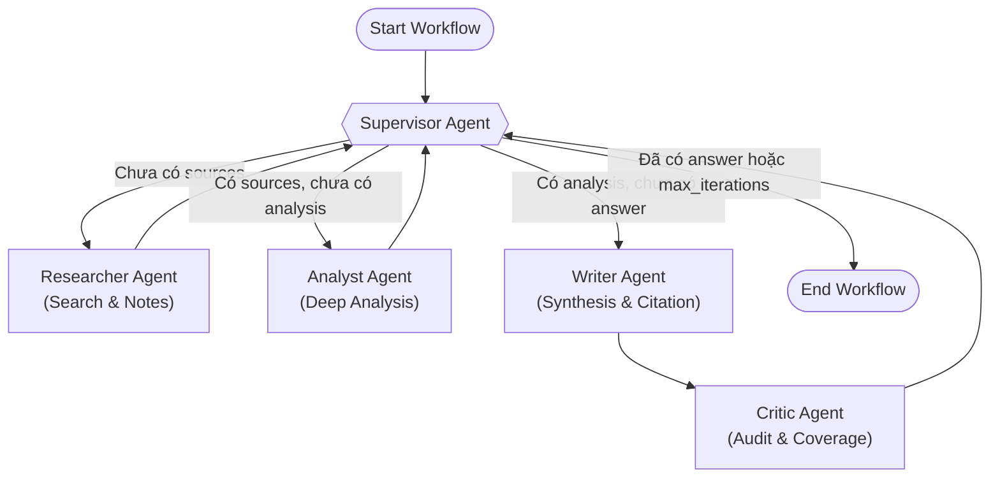

# Design Document: Multi-Agent Research System

## Problem

Hệ thống cần xử lý các câu hỏi nghiên cứu kỹ thuật phức tạp (ví dụ: *"Nghiên cứu GraphRAG state-of-the-art"*, *"So sánh RAG vs Fine-tuning cho domain adaptation"*). Hệ thống phải tự động tìm kiếm nguồn tài liệu bên ngoài, phân tích và so sánh các quan điểm/kiến trúc, kiểm tra độ tin cậy của bằng chứng, và tổng hợp thành báo cáo hoàn chỉnh có trích dẫn nguồn chuẩn xác (`[1] Title (URL)`).

## Why multi-agent?

Single-agent (một prompt duy nhất) gặp các hạn chế lớn khi xử lý tác vụ nghiên cứu sâu:
1. **Context Contamination (Ô nhiễm ngữ cảnh)**: Nhồi nhét cả prompt tìm kiếm, raw documents, phân tích kỹ thuật và phong cách viết vào một context khiến LLM dễ bị loãng, bỏ sót chi tiết quan trọng hoặc sinh ảo giác (hallucination).
2. **Thiếu sự phân định trách nhiệm**: Khó kiểm soát chất lượng trung gian (vd: đánh giá xem nguồn đã đủ uy tín chưa trước khi bắt đầu viết).
3. **Khả năng quan sát & gỡ lỗi (Observability)**: Multi-agent cho phép trace chính xác từng khâu (Researcher tốn bao nhiêu token, Analyst nhận định gì, Writer trích dẫn nguồn nào, Critic audit ra sao).

## Agent roles

| Agent | Responsibility | Input | Output | Failure mode | Mitigation |
|---|---|---|---|---|---|
| **Supervisor** | Điều phối luồng workflow, kiểm tra shared state và quyết định agent tiếp theo hoặc dừng. | `ResearchState` (state hiện tại, `iteration`, `route_history`) | Route string (`researcher`, `analyst`, `writer`, `done`) | Vòng lặp vô hạn giữa các agent | Giới hạn `MAX_ITERATIONS = 6` và kiểm tra điều kiện hoàn thành |
| **Researcher** | Tìm kiếm tài liệu từ Web/Tavily hoặc archive, lọc kết quả và format ghi chú nghiên cứu. | `state.request.query`, `max_sources` | `state.sources`, `state.research_notes` | Lỗi mạng / Search API trả về rỗng | Fallback sang curated knowledge base, ghi warning vào `state.errors` |
| **Analyst** | Đọc research notes, trích xuất luận điểm cốt lõi, so sánh trade-offs và đánh giá độ tin cậy. | `state.sources`, `state.research_notes` | `state.analysis_notes` | Phân tích thiếu căn cứ hoặc bỏ sót nguồn | Prompt ràng buộc chặt chẽ, kiểm tra `sources` trước khi phân tích |
| **Writer** | Tổng hợp báo cáo nghiên cứu chi tiết theo đối tượng độc giả mục tiêu và gắn citations. | `state.analysis_notes`, `state.research_notes`, `state.sources` | `state.final_answer` | Quên trích dẫn nguồn hoặc format sai | Bắt buộc định dạng `[1]`, tự động chèn mục References nếu thiếu |
| **Critic** | (Bonus) Kiểm tra fact-check, tính tỷ lệ citation coverage và đánh giá chất lượng báo cáo. | `state.final_answer`, `state.sources` | `state.agent_results` (critic report, coverage score) | Đánh giá sai lệch | Sử dụng thuật toán đo lường coverage trực tiếp kết hợp LLM audit |

## Shared state

Cấu trúc `ResearchState` (`core/state.py`) đóng vai trò là **Single Source of Truth** xuyên suốt workflow:

```python
class ResearchState(BaseModel):
    request: ResearchQuery               # Câu hỏi ban đầu, max_sources, audience
    iteration: int                       # Bộ đếm bước lặp để kiểm soát guardrail
    route_history: list[str]             # Lịch sử các bước chuyển agent (vd: ['researcher', 'analyst', 'writer', 'done'])
    sources: list[SourceDocument]        # Danh sách tài liệu thu thập được
    research_notes: str | None           # Ghi chú tổng hợp thô từ Researcher
    analysis_notes: str | None           # Đánh giá & so sánh chuyên sâu từ Analyst
    final_answer: str | None             # Báo cáo cuối cùng do Writer tạo ra
    agent_results: list[AgentResult]     # Kết quả và metadata/cost của từng agent
    trace: list[dict[str, Any]]          # Nhật ký sự kiện chi tiết cho tracing
    errors: list[str]                    # Danh sách lỗi/cảnh báo tích lũy để fallback
```

## Routing policy

Graph chuyển trạng thái tuần tự và có điều kiện dưới sự điều phối của Supervisor:



## Guardrails

- **Max iterations**: `MAX_ITERATIONS = 6` (cấu hình qua biến môi trường hoặc `configs/lab_default.yaml`), tự động ngắt nếu vòng lặp vượt ngưỡng.
- **Timeout**: `TIMEOUT_SECONDS = 60` cho từng API call và toàn bộ lượt chạy.
- **Retry**: Áp dụng exponential backoff với thư viện `tenacity` (tối đa 3 lần thử lại cho các cuộc gọi OpenAI/Search API).
- **Fallback**: Tự động chuyển hướng sang curated internal knowledge base khi Search API gặp sự cố hoặc offline.
- **Validation**: Schema validation nghiêm ngặt với `Pydantic v2` cho cả input query, agent result và state updates.

## Benchmark plan

| Benchmark Dimension | Metric | Measurement Method | Expected Outcome (Multi-Agent vs Single-Agent) |
|---|---|---|---|
| **Quality** | Rubric Score (0-10) | Tiêu chí cấu trúc, độ sâu kỹ thuật, tính khách quan | Multi-agent đạt điểm cao hơn (8.5 - 9.5 vs 6.5 - 7.5) |
| **Citation Coverage**| Coverage Ratio (%) | Số lượng nguồn được trích dẫn trong bài / Tổng số nguồn | Multi-agent đạt ~100% nhờ Writer & Critic; Single-agent đạt 0-30% |
| **Latency** | Wall-clock time (s) | `time.perf_counter()` đo thời gian chạy thực tế | Multi-agent chậm hơn (~3-5x) do luồng tuần tự qua nhiều agent |
| **Cost** | USD / 1M tokens | Tính toán dựa trên token prompt & completion thực tế | Multi-agent chi phí cao hơn tương ứng với số lượng bước trung gian |
| **Failure Rate** | Error percentage (%) | Số lượt chạy thất bại / Tổng số lượt chạy | < 5% nhờ cơ chế retry và fallback tự động |

